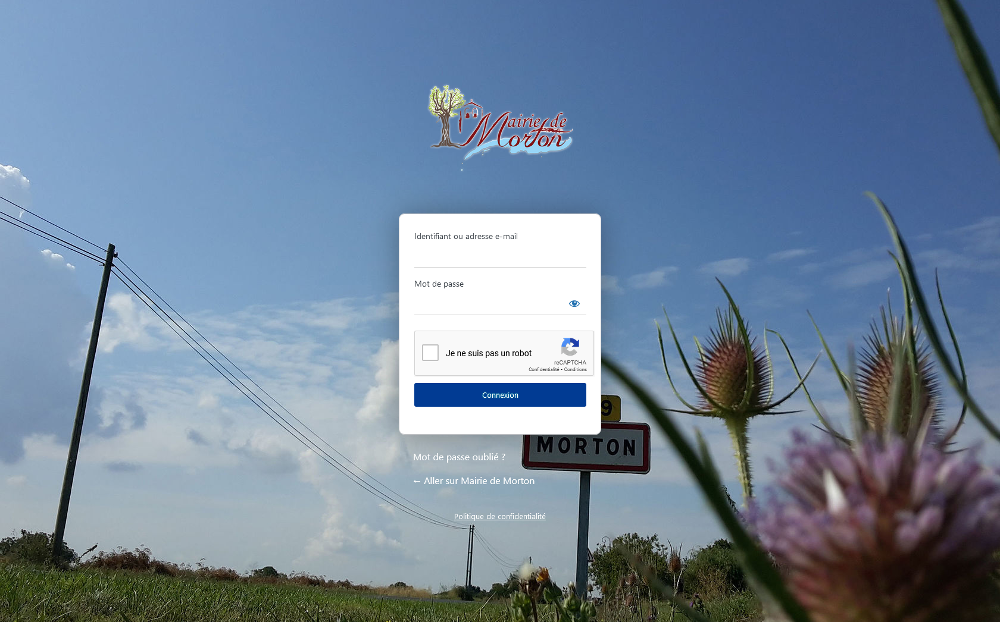

Comment se connecter à l'admin WordPress ?
------------------------------------------

Avant tout, vous allez devoir vous connecter à l'admin WordPress. Pour ce faire, vous allez taper dans la barre d'adresse le nom de domaine de votre site, suivi de **/mm86-adm2108**.

Par exemple, si le nom de domaine de votre site est mairiemorton.fr, alors l'adresse de connexion WordPress sera **https://mairiemorton.fr/mm86-adm2108** (dans le cas où le site est en développement alors l'adresse temporaire sera https://mmdevweb1.mateomoreau.com/mm86-adm2108). 

Vous devriez arriver sur un écran de connexion comme celui-ci.

Il ne vous reste plus qu'à entrer le mot de passe et l'identifiant. Vous serez alors redirigé sur le panneau d'administration.
